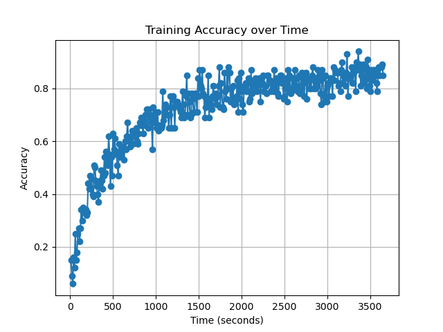

# mynet

**mynet** is a personal deep learning research project focused on implementing and training neural networks from scratch (with minimal libraries) on classic datasets such as **MNIST** and **ESC-50**.  
The goal is to explore the behavior of different architectures, activation functions, and optimization strategies in small to medium-scale deep learning experiments.

---
# Usage

Feel free to clone the repository and experiment with the models yourself. All the datasets are already downloaded on this repository.
One prerequisit is you need to have open-blas installed on your system, to do this on ubuntu its

```
sudo apt update
sudo apt install libopenblas-dev
```

---

## Current Results

**Dataset:** MNIST  

**Model:** Fully Connected Neural Network (Sigmoid activations)  

**Batch Size:** 256

**Peak Accuracy:** ~94% after ~1 hour of training  

Visualization of training progress:  


Raw metrics are available in [`images/Figure_1.csv`](images/Figure_1.csv).

---


