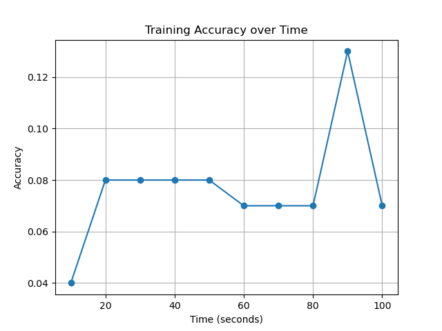

# mynet

**mynet** is a personal deep learning research project focused on implementing and training neural networks from scratch (with minimal libraries) on classic datasets such as **MNIST**.  
The goal is to explore the behavior of different architectures, activation functions, and optimization strategies in small to medium-scale deep learning experiments.

---
# Usage

Feel free to clone the repository and experiment with the models yourself. All the datasets are already downloaded on this repository.
One prerequisit is you need to have open-blas installed on your system, to do this on ubuntu its

```
sudo apt update
sudo apt install libopenblas-dev
```

---

## Current Results

Note: My computer is using an AMD Ryzen 5 7600 results are likely to vary. 

**Dataset:** MNIST  

**Model:** Neural Network with 2 hidden layers with 32 neurons.

**Batch Size:** 256

Visualization of training progress:  

Learning rate - 0.1


Learning rate - 5.0


Learning rate - 10.0


Learning rate - 100.0


Learning rate - 500.0



From the results, a good strategy might be to start off with a high learning rate, say 100, and then once a decent peak has been hit, switch the learning rate to a more fine-tuned one, like 5.0. Due to the erratic nature of high learning rates, they may learn very quickly initially but will never progress to optimal performance. Analogously, if we have too low a learning rate, although the learning will be stable, it will take much longer (an hour, in the case of 0.1, to get a network that is usable). It may be beneficial to automate this process of increasing and decreasing the learning rates rather than a human doing so by monitoring the relative performance of the network.

**Dataset:** ESC50  

**Model:** Neural Network with 2 hidden layers with 1024 and 512 neurons respectively.

**Batch Size:** 64

Learning rate = 100.0


From just this this test alone we can see the a normal neural network will not suffice. The input data is large (~200_000 samples) and hence the network trains a lot slower. I tried to treat the input data as an image and scale it down like that but the results don't seem to be good enough. It seems we will need a downsizing step (perhaps with a convolutional neural network).

---


